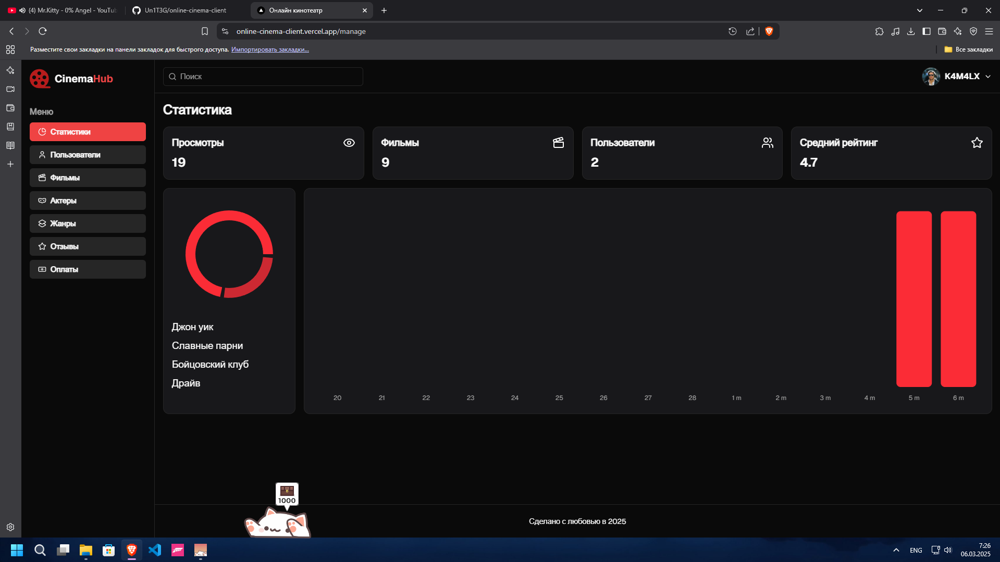
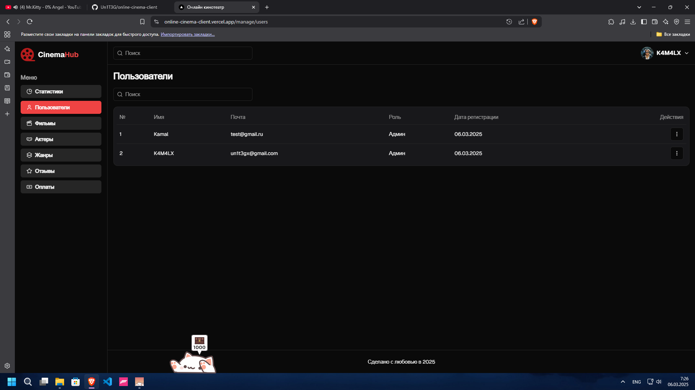
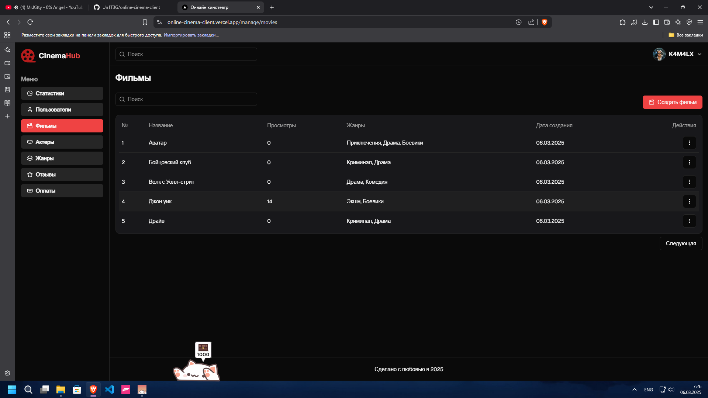
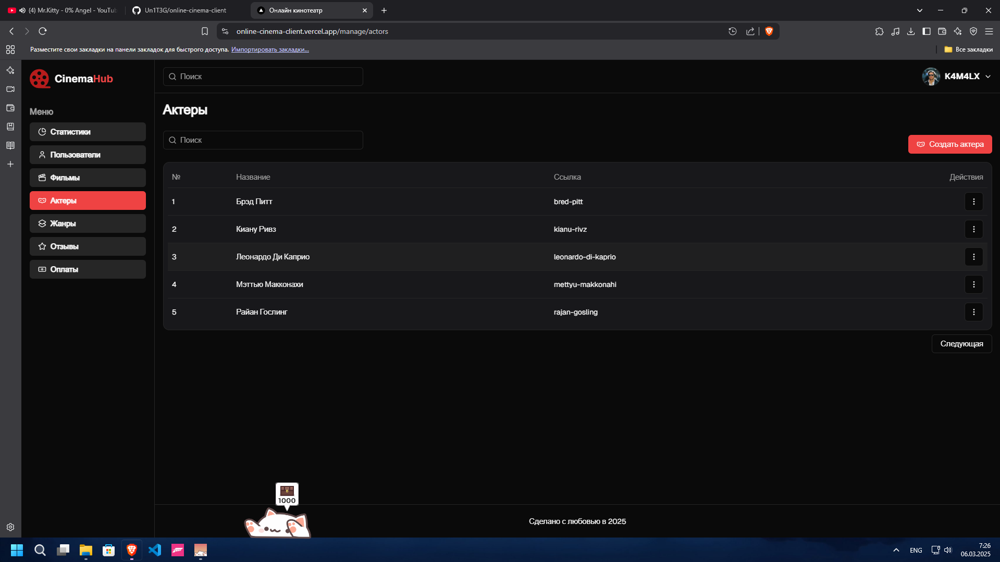
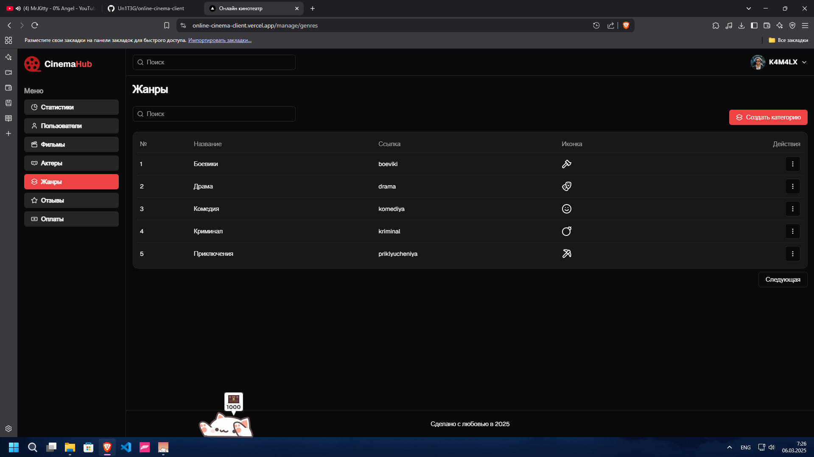
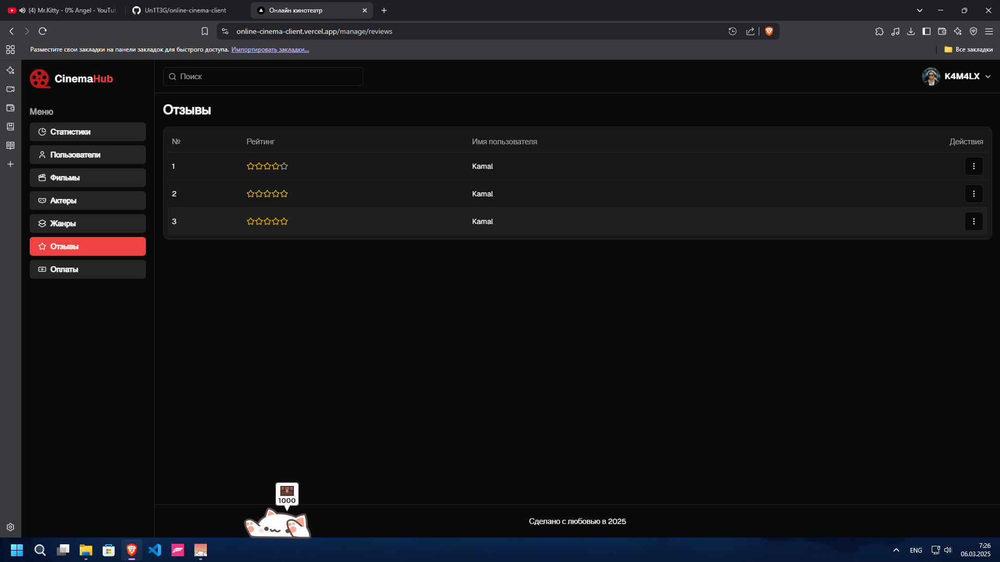
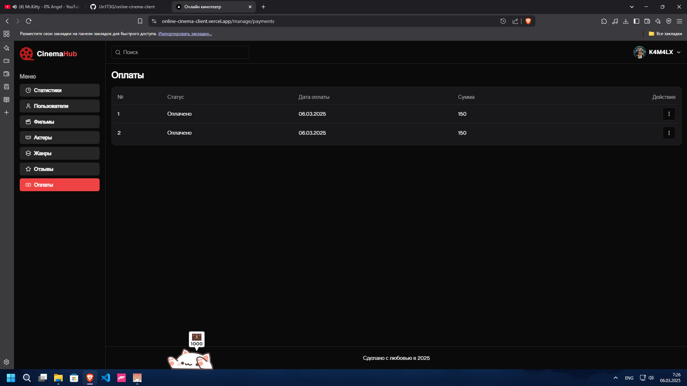
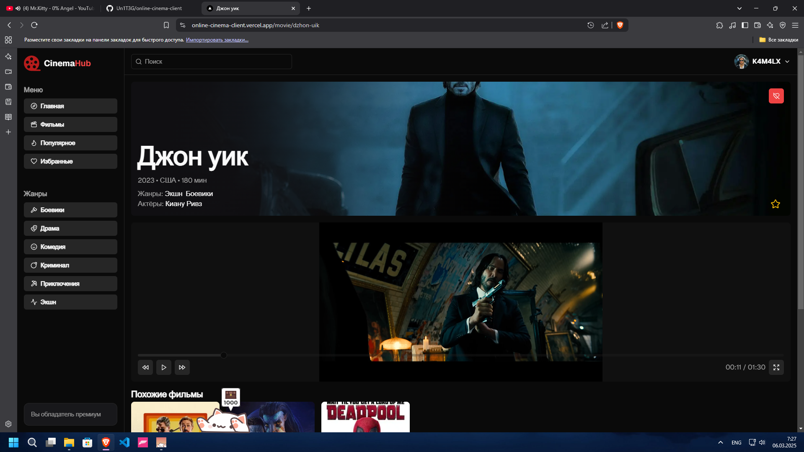

# Онлайн кинотеатр (клиентская часть)

Онлайн-кинотеатр с админ-панелью – это платформа для просмотра фильмов и сериалов с удобным управлением контентом. Пользователи могут искать, смотреть и сохранять видео, а администраторы – добавлять фильмы, модерировать комментарии, управлять подписками, отслеживать аналитику и настраивать рекламу. Поддержка различных устройств, система рекомендаций и гибкие настройки безопасности делают сервис удобным и функциональным.

### Ссылки

[Ссылка на веб-сайт](https://online-cinema-client.vercel.app/)

[Серверная часть](https://github.com/Un1T3G/online-cinema-server)

### Скриншоты

### Используемые технологии

- Next js (Фреймворк)
- React hook forms (Работа с формами)
- Zod (Валидация схемы)
- Shadcn (UI библиотека)
- React query, Zustand (Cтейт-менеджмент)
- FSD (Методология)
